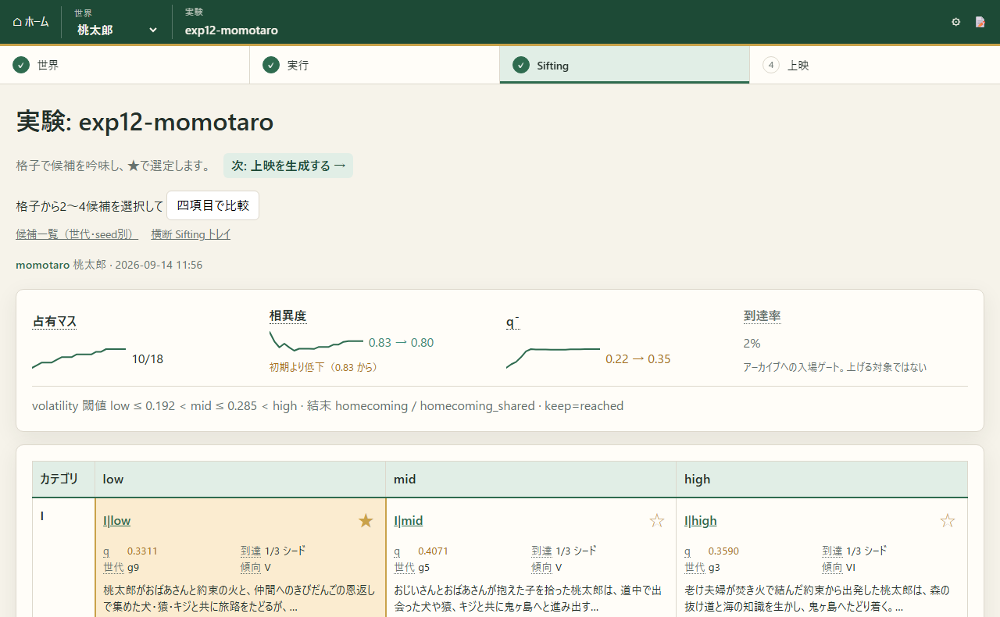

<div align="center">

# WorldBloom

**遺伝的アルゴリズム×LLM による結末固定型の物語生成エンジン**

[](LICENSE)
[](https://github.com/ATO-LABO/WorldBloom/releases/latest)

[](https://github.com/ATO-LABO/WorldBloom/releases/latest/download/WorldBloom-Studio-portable.zip)

展開して `WorldBloom-Studio.exe` を開くだけ。世界を選んでGA実験を実行し、Sifting・あらすじ/本文生成まで行えます<br>
（Python 3.11以上が別途必要です。詳細は同梱の README.txt を参照）

インストールせずブラウザで見るだけなら → [公開ビューア](https://ato-labo.github.io/WorldBloom/)（桃太郎・恋愛・探偵の3実験）

3分でわかるダイジェスト動画 → [YouTube](https://youtu.be/Yozi2qb2IQg)

[](https://youtu.be/Yozi2qb2IQg)



</div>

## これは何か

物語の**設定と結末を先に固定**し、そのあいだの道のりだけを GA（遺伝的アルゴリズム）×シミュレーションで探すツールです。「結末が既知の物語」（昔話、恋愛もの、探偵もの）は、結末そのものではなく道中の経路にこそ面白さがある、という前提に立っています。

主体は7層構造（力・認識・資源・段階・身分・目的物・伏線）＋ vitality で表現し、遺伝子は行動系列ではなく「戦略ベクトル」（9スカラー）です。固定シードで走らせたシミュレーションのうち、固定結末に到達したものだけを MAP-Elites 格子（主導カテゴリ I〜VI × volatility）に残します。**出来事の生成に LLM は関与しません。**格子に残ったあらすじは人が読んで選び、選ばれた道のりだけを LLM が本文化します。

StorySim（同作者の別プロジェクト。世界と人物をシミュレートし、面白かったログを物語に書き起こす方式）から要素を切り取って再構築したもので、フォークではありません。

自分で進化を回す・文章を生成し直す場合は、以下のソースから実行してください。

## 必要なもの

- Python 3.11 以上（開発は 3.13）
- `pip install -r requirements.txt`（PyYAML のみ）

あらすじ・本文の生成に LLM を使う場合（任意）。既定はローカルの Ollama＋Qwen3.5（本応募の提出物はこのモデルで生成。詳細は開示文書を参照）:

1. [Ollama](https://ollama.com) をインストール
2. `ollama pull qwen3.5:9b-q4_K_M`

より大きなモデル（`qwen3.6:35b` など）への切り替えも `--backend`/`settings.json` の `model` で可能ですが、提出済みの本文・あらすじの生成条件とは異なります。

代替として `claude-cli` / `codex-cli` / Anthropic API / OpenAI API のいずれかも選べます（`--backend` で切り替え）。

## 5分で試す

### (a) clone

```
git clone https://github.com/ATO-LABO/WorldBloom.git
cd WorldBloom
pip install -r requirements.txt
```

### (b) settings.json を作る（Ollama を使う場合）

```json
{
  "output": {
    "ollama": {
      "model": "qwen3.5:9b-q4_K_M",
      "base_url": "http://localhost:11434",
      "think": false,
      "options": {"num_ctx": 16384, "num_predict": 4096}
    }
  }
}
```

`options` は既定（`num_ctx` 16384・`num_predict` 4096）に上書きマージされるので、変えたいキーだけ書けばよい。`think` は思考トークンを抑えるため既定で `false`。`settings.json` は `.gitignore` 対象（APIキーを含み得るため）。

### (b-2) Bonsai 2 27B（llama-server）を使う場合

PrismML の Ternary Bonsai 2 27B は独自量子化形式のため Ollama では動かず、PrismML フォーク版 llama.cpp の `llama-server`（OpenAI 互換 API）でのみ動く。

1. フォーク版バイナリを入手する: [PrismML-Eng/llama.cpp の releases](https://github.com/PrismML-Eng/llama.cpp/releases) から Windows なら `win-cuda-12.4` の `llama-...-bin-...zip` と `cudart-...zip` の両方（CUDA ランタイムが別 zip なので片方だけでは動かない）
2. GGUF を入手する: Hugging Face `prism-ml/Ternary-Bonsai-2-27B-gguf` の `PTQ1_0`
3. サーバーを起動する:

```
llama-server.exe -m Ternary-Bonsai-2-27B-PTQ1_0.gguf --alias bonsai2-27b -ngl 99 -np 1 -c 10240 -fa on --port 8089 --host 127.0.0.1 --reasoning-budget 2048 --reasoning-budget-message "思考の上限に達した。ここで思考を終え、直ちに最終回答の本文だけを書く。"
```

`--alias` は必須（省略するとモデル名がファイルパスになり、`settings.json` の `model` と一致しなくなる）。`--reasoning-budget` も必須（思考トークンの上限はサーバー起動フラグでしか効かず、リクエスト側で送っても無視されるため、これが無いと `finish_reason: "length"` で応答が打ち切られ、WorldBloom 側は失敗として扱う）。

`settings.json`:

```json
{
  "output": {
    "default_backend": "llama-server",
    "llama-server": {
      "base_url": "http://127.0.0.1:8089",
      "model": "bonsai2-27b",
      "think": true,
      "options": {"temperature": 0.7, "top_p": 0.8, "top_k": 20, "min_p": 0, "presence_penalty": 1.0, "max_tokens": 8192}
    }
  }
}
```

注意:
- VRAM 8GB では Ollama のモデルと同居できない。生成前に `ollama ps` で Ollama 側のモデルが退避済み（unloaded）か確認する
- ノート GPU は連続生成で 86℃ に達することがある。長時間連続実行する場合は休止を挟む

### (c) サンプルをビューアで見る

同梱の `samples/`（桃太郎・探偵・恋愛の3実験、格子・あらすじ・本文入り）をブラウザで見る:

```
python viewer/server.py --runs samples --port 5401
```

`http://127.0.0.1:5401/` を開く。新しく進化を回す・選定をビューアから操作する場合は `--control <空フォルダ>` を追加する。その場合は `--runs` もリポジトリ外のディレクトリ（自分の実験出力先）にする。リポジトリ内の `samples` は閲覧専用で、`--control` とは併用できない。

### (d) 自分で進化を回す

```
python scripts/evolve.py --project projects/momotaro --template templates/momotaro \
  --out <出力先>/exp1 --generations 20 --population 100 --seeds 3 --keep reached --processes 4
```

所要時間の目安: 20コアで約1時間（実測: exp12 が6プロセスで約70分。計測は2026-09-14時点のコードに基づくため、その後のGA/ビューア側の性能改善（WB-OPT-001〜003）で実際はこれより速くなっている可能性がある）。出力先はリポジトリ外を推奨（`.gitignore` は `runs/` を無視するが、リポジトリ内に大量の実験出力を置くべきではない）。`--project` / `--template` は `momotaro` / `detective` / `romance` の3ジャンルを同梱。

### (e) あらすじ化・本文化

```
python scripts/synopsize.py --archive <出力先>/exp1/archive.json --runs <出力先>/exp1 \
  --out <出力先>/exp1/synopses.json --backend ollama --project projects/momotaro --template templates/momotaro

python scripts/narrate.py --archive <出力先>/exp1/archive.json --selection <出力先>/exp1/selection.json \
  --out <出力先>/exp1/stories --backend ollama --project projects/momotaro --template templates/momotaro
```

`selection.json` は `{"selected": ["III|high"]}` の形（格子のセルキー = カテゴリ|volatility_bin）。あらすじの確認・格子セルの選定はビューア（`--control` 付きで起動時）からも行える。

### (f) 無作為基準との比較

```
python scripts/random_baseline.py --project projects/momotaro --template templates/momotaro --out <出力先>/baseline
```

方針を持たない完全無作為なシードだけで結末に届く経路の多様性を測る、GAの効果を測るための対照実験。

## 決定論

同じ `(world, genome, seed, precedent)` の組で `layers.jsonl` はバイト一致します。回帰テスト:

```
python -m unittest discover -s tests
```

## リポジトリ構成

```
engine/      7層の主体・世界・動詞・勝負解決・述語評価・vitality・ログ
gapengine/   遺伝子・Policy・分類器・前例表・QD・進化ループ・あらすじ化・説明抽出
execution/   ビューアから進化・出力ジョブを操作するための設定/ジョブ/権限境界
viewer/      HTTP ビューア（標準ライブラリのみ。格子・あらすじ・本文・実行管理画面）
scripts/     進化・あらすじ化・本文化・無作為基準・静的公開・サンプル抽出などの実行スクリプト
templates/   ジャンルテンプレート（行動グラフ・修飾ルール・正典プライア・QD軸・伏線ライブラリ）
projects/    世界と主体の初期状態（7層）。momotaro / detective / romance
samples/     ビューアで開ける最小サンプル（3実験。scripts/pack_samples.py で生成）
tests/       回帰テスト（unittest）
docs/        設計書・実装計画・開示文書
```

ラン出力は既定でリポジトリ外に置く（`--out` で明示する）。`samples/` は例外で、配布用にリポジトリへ含めている。

## 解説ページ（ATOM-BOX サイト）

仕組みや背景を読み物として整理したページを公式サイトに置いています。コードを読む前の入口としてはこちらが向いています。

- [WorldBloom（ハブ）](https://www.atom-box.jp/worldbloom/) — 概要・できること・ダウンロード
- [WorldBloom の仕組み](https://www.atom-box.jp/worldbloom/how-it-works/) — 7 層構造、遺伝子、結末固定、QD 格子、出口
- [WorldBloom を試す](https://www.atom-box.jp/worldbloom/get-started/) — Studio / 公開ビューア / ソースからの実行
- [なぜ GA と LLM を組み合わせるのか](https://www.atom-box.jp/worldbloom/ga-and-llm/) — 両者の得手不得手と分業の理由
- [物語生成研究の中での位置づけ](https://www.atom-box.jp/worldbloom/background/) — Tale-Spin、進化的生成、MAP-Elites、LLM 長編生成との関係と参考文献
- [生成例: 桃太郎](https://www.atom-box.jp/worldbloom/example-momotaro/) — 同梱サンプル exp12 の格子・あらすじ・本文
- [用語集](https://www.atom-box.jp/worldbloom/glossary/) — 画面と解説に出る用語の定義

## ドキュメント

- 詳細設計: [docs/2026-09-11_gapengine-detailed-design.md](docs/2026-09-11_gapengine-detailed-design.md)
- ビューア UI/UX 設計: [docs/2026-09-12_viewer-ux-design.md](docs/2026-09-12_viewer-ux-design.md)
- 公開ページ（格子・あらすじ・本文を読むだけの静的サイト）: https://ato-labo.github.io/WorldBloom/
- ダイジェスト動画（3分、YouTube）: https://youtu.be/Yozi2qb2IQg

## ライセンス

[Apache License 2.0](LICENSE)。Copyright 2026 ATO-LABO.
