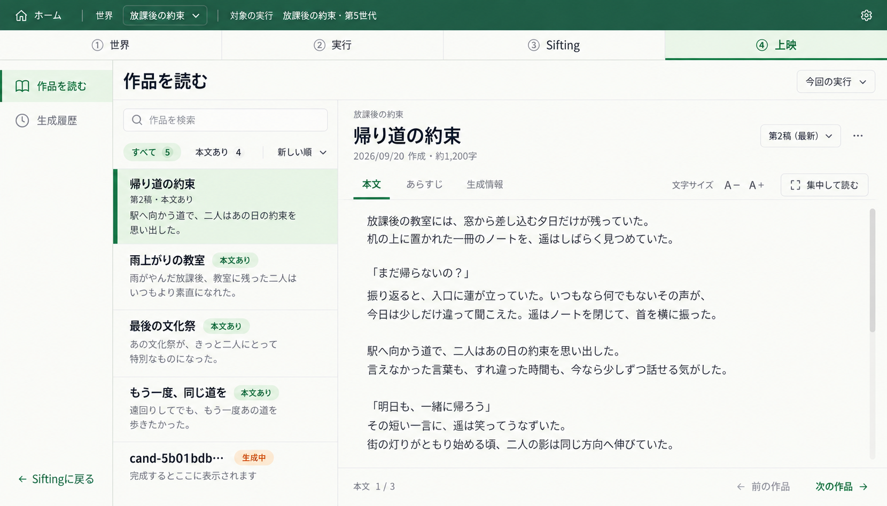

# 上映画面の改善案

2026-09-20。画像案の承認後、読書・生成履歴の上映ワークスペースを実装。

## 方向性

上映の主作業を「作品を選んで読む」にする。現在の生成版・ジョブ単位の表は「生成履歴」へ移し、作品を読む画面は候補と本文を中心に構成する。
上部の①世界／②実行／③Sifting／④上映を維持。全幅を使う外枠とゴシック体を共通化する。

- 左メニュー：作品を読む／生成履歴。下部にSiftingへ戻る導線。
- 作品一覧：タイトルまたは候補ID、本文の抜粋、本文あり／生成中などの状態。検索と並び替え。
- 読書ペイン：1作品を表示。本文／あらすじ／生成情報を切り替え、生成情報は初期表示しない。
- 稿は候補ごとに切り替える。複数の生成版を別作品として一覧へ重複させない。
- 文字サイズ、集中して読む（一覧を畳む）、前後の作品移動。長い本文と多数の作品は各領域内でスクロールする。
- 再生成や保存操作は「…」内へまとめる。読書中に生成ボタンを大きく置かない。

## データと表示の区別

- 画像の作品名・本文・作成日時・件数は配置用サンプル。現データへ追加していない。
- 保存済みの作品名がなければ候補IDの短縮表示を使う。タイトルを付けるために自動でLLMを呼ばない。
- 一覧の作品はrun_id＋candidate_idで識別し、本文はその候補に属する生成版・試行・検証済み本文へ結び付ける。
- 最初は最新の成功稿を表示。新しい稿が生成中・失敗でも、過去の完成稿を読める状態を保持する。
- 稿順・最新表示には保存された日時などの順序根拠が必要。ランダムなoutput_idの辞書順を新旧判定に使わない。
- あらすじはその稿の生成に使った参照を優先。別候補・別のセルの要約を混ぜない。
- 本文なし、プロンプトのみ、失敗、結果不明、破損は本文ありと区別する。結果不明の自動再生成はしない。
- 画像の「本文1/3」は読書位置の例。実装ではスクロール方式なら「読了率」など実際の表示方式に合わせ、架空のページ数を出さない。
- 集中表示でも上部の4工程と戻る操作は維持。本文の行長は読みやすく制限し、アプリ外枠の左右マージンとは区別する。
- 世界変化の表示は引き続き保留。あらすじモーダルの承認済み設計は別途維持する。

## 成果物

内蔵image_genで生成後、背景のノイズと重複スクロールバーだけを修正。最終画像を目視確認済み。
画像：images/2026-09-20-screening/screening-reader-v1.png
使用プロンプト：images/2026-09-20-screening/screening-reader-v1.prompt.txt

実装内容と確認結果は [実装・検証記録](2026-09-20_screening-workspace-validation.md) を参照。

## 実装した画面構成

- `/outputs`：候補ごとにまとめた作品一覧と読書ペイン。実行、本文あり、検索、保存日時順で絞り込み。
- `/outputs/{output_id}`：上映生成は該当稿を選択した読書画面。既存の `#entry-{candidate_id}` リンクも対象候補へ引き継ぐ。
- `/outputs?view=history`：本文・あらすじ双方の生成履歴。日時順の記録、状態、内訳、詳細。
- `/outputs/{output_id}?view=record`：従来の生成記録・再生成・復旧操作を全幅の上映枠へ統合。本文生成の確認手順や結果不明の再生成確認は維持。
- 作品を読む画面では、生成中の稿を読み取り専用で確認し、変化した際に「表示を更新」を案内する。読書位置や選択稿を自動で切り替えない。
- 本文／あらすじ／生成情報のタブ間で読書位置を保持。文字サイズは同一タブ内の画面移動後も保持。集中表示は一覧と左メニューを畳み、上の4工程を残す。
- 760px以下では一覧と読書欄を切り替える。繰り返しになる実行名・日時・補助説明を省き、本文の高さを確保する。稿の状態・作成日時は選択欄で確認できる。
- 保存日時が不明・同時刻の場合は「最新」「第N稿」を断定せず、稿IDで識別する。
- 世界変化と、別途設計済みのあらすじ生成モーダルは今回の実装対象に含めない。
