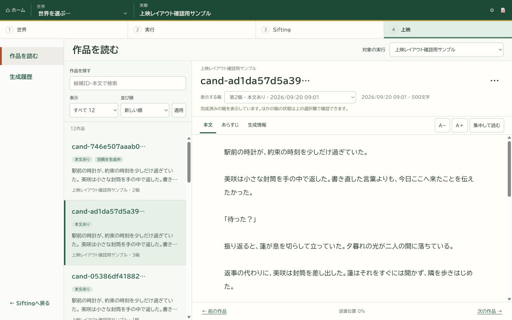
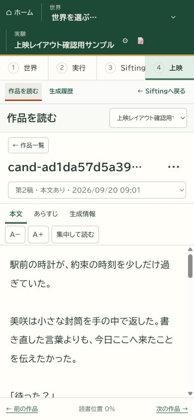

# 上映ワークスペース 実装・検証記録

2026-09-20。ユーザーが画面例を承認し、設計と実装を依頼。未コミット。
対象は `G:\マイドライブ\Projects\WorldBloom_v2`。旧WorldBloomのコード、世界拡張、既存のユーザー生成結果は変更していない。

## 変更

- `viewer/screening_view.py`：run_idとcandidate_idの組で作品をまとめ、保存日時を使った稿順と最新成功稿を構成する。本文SHA検証、稿の入力あらすじの候補・run・入力・試行・本文SHAの照合。
- `viewer/screening_pages.py`：全幅の読書・履歴枠、検索、表示条件、稿切替、本文／あらすじ／生成情報、前後移動。
- `viewer/static/screening-workspace.css`、`.js`：領域内スクロール、文字サイズ、集中表示、キーボードでのタブ操作、狭幅の一覧切り替え、生成状況の更新通知。
- `viewer/output_pages.py`：読書画面への振り分け、日時順の履歴、既存の生成記録を全幅の上映枠に接続。明示的な再生成・結果不明の確認・保存復旧の既存操作を維持。
- `viewer/server.py`：追加した静的ファイルを登録。

本文を読む際にブラウザーへ渡すのは選択稿の本文と一覧用の短い抜粋。ほかの稿の全文をHTMLへまとめて埋め込まない。サーバー側では一覧の組み立て時に成功稿の本文を検証・読み取るため、非常に多数の長文出力に対する性能測定は別途必要。
現行の保存形式に独立した作品名がない場合は短縮候補IDを表示し、題名を自動生成しない。

## 自己検証

1. `test_screening_pages.py` 8件 + `test_output_pages.py` 27件 + `test_workbench_pages.py` / `test_run_settings.py` 41件：合計76件成功。
2. 生成履歴の日時順表示と失敗・結果不明の稿の確認を追加後、`test_screening_pages.py` 9件 + `test_output_pages.py` 27件：合計36件成功。

二回の対象は重複する。異なるテストは77件。全リポジトリの一括回帰・独立レビューは実施していない。

確認項目：同一候補の複数稿、別runの同名候補を混ぜない、新しい失敗・結果不明の稿が成功稿を隠さない、日時不明時の表示、あらすじの固定参照、破損本文の非表示、本文なし、検索結果なし、HTMLエスケープ、生成記録への導線、静的ファイル、閲覧時の生成未起動。
既存の再生成・結果不明の明示確認・復旧ボタンのテストは `?view=record` の移動先で維持。

## ブラウザー確認

内蔵ブラウザーで実装した画面を操作。専用の隔離されたサンプル生成記録を使用し、LLMや実際の進化計算は起動していない。

- 1440×900：外側の幅・高さが画面に一致。読書領域の高さ471px。作品一覧と本文は別々にスクロール。
- 1280×720：外側にスクロールを作らず、読書領域の高さ291pxを確保。
- 390×844：外側の幅390px・高さ844px、読書領域306px。一覧に戻る／候補を開く、集中表示と解除を確認。
- 第1稿／第2稿／本文未生成の第3稿の切り替え。文字サイズ変更と稿移動後の保持を確認。
- あらすじ表示、矢印キーによるタブ切替、本文の読書位置保持、読書位置の割合表示を確認。
- 日時順の生成履歴から生成記録を開き、再生成リンクと読書画面への戻りを確認。
- ブラウザーのエラー記録なし。
- 通常のプレビュー `http://127.0.0.1:5549/outputs` への反映と、対象実行に本文作品がまだない場合の案内・世界の選択状態を確認。既存のあらすじ生成記録は履歴に残る。

生成中の更新通知は初期データと読み取り専用の接続を確認した。実LLM処理の完了から通知までの通し試験、通信切断・復帰のブラウザー試験は未実施。

## 画面記録

以下は実装画面。本文・候補は配置確認用のサンプルで、ユーザーの生成結果ではない。

