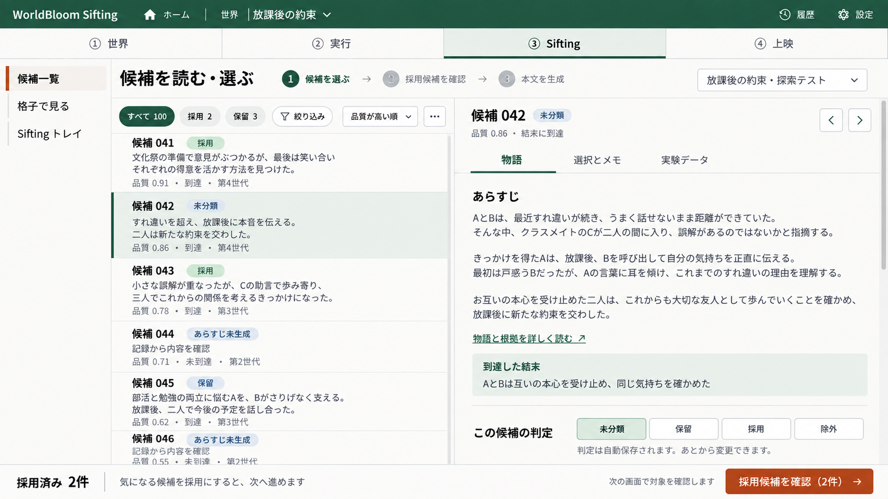
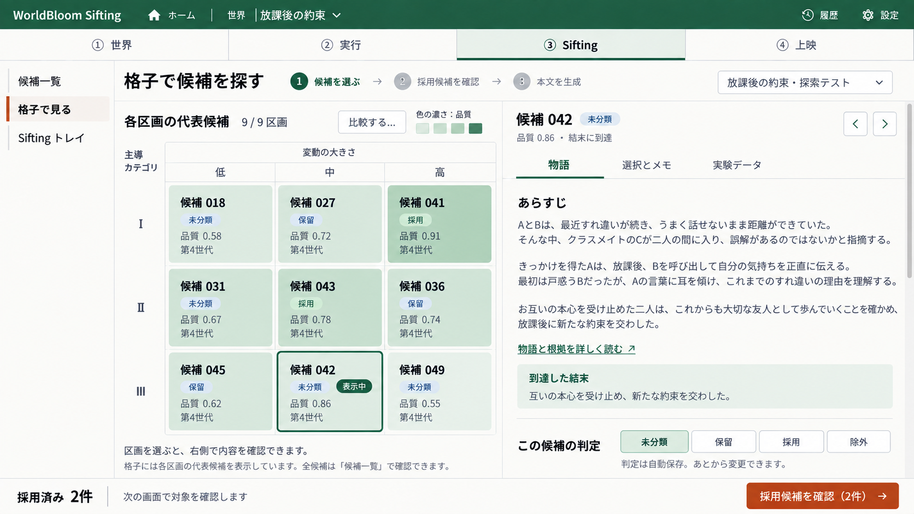
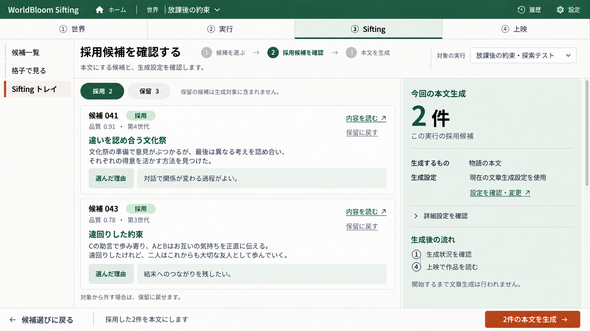

# Sifting ワークスペース設計

作成日：2026-09-20
対象：WorldBloom_v2
状態：画面実装・実画面での自己検証済み。ユーザー確認待ち。検証記録は同日付の sifting-workspace-validation.md を参照。

## 1. 目的と設計判断

Siftingを「候補を読む・選ぶ → 採用候補を確認 → 本文を生成」の順序にする。
候補一覧と格子は同じ選定段階の別表示。トレイは採用候補の確認と生成開始を担う。
主操作は各画面に1つとし、あらすじの準備・判定の変更・次画面への移動を同じ強さのボタンで並べない。

| 画面 | 主な作業 | 主ボタン |
|---|---|---|
| 候補一覧 | 全候補を読み、判定する | 採用候補を確認（N件） |
| 格子で見る | 各区画の代表候補から違いを探し、判定する | 採用候補を確認（N件） |
| Siftingトレイ・採用タブ | 対象と生成設定を確認する | M件の本文を生成 |
| Siftingトレイ・保留タブ | 保留候補を再検討する | 採用候補を確認（N件） |
| あらすじ準備モード | あらすじを作る対象を指定する | あらすじの生成対象を確認（K件） |
| 格子の比較モード | 比較する代表候補を2〜4件指定する | 選んだK件を比較 |

Nは選択中の実行の全採用件数。画面の絞り込みとは独立。
Mは新規生成可能な対象件数。生成済み・結果不明・復旧待ちなどを考慮した件数であり、Nと同じとは限らない。
Kは現在の補助モードの選択件数。N・M・Kを同じ「選択件数」として扱わない。
候補一覧・格子ではN=0の主ボタンを無効にし、「候補を採用すると次へ進めます」と表示する。

本設計に沿って画面を実装。既存の未コミットの実行設定・実行条件UIの変更も保持している。
GA、評価式、物語生成モデルの変更、新しい自動生成処理はこの設計の範囲に含めない。

## 2. 採用した画面イメージ

画像は配置・色・操作階層の基準。文章、候補番号、品質値、件数はサンプル。
例外状態と操作の意味は本文の仕様を優先する。

### 候補一覧

### 格子で見る

### Siftingトレイ

## 3. 共通レイアウトとナビゲーション

- 上部の①世界／②実行／③Sifting／④上映を維持する。選定・比較・生成前確認は③を選択状態にする。
- 左メニューは候補一覧／格子で見る／Siftingトレイ。実行中の画面と同じ全幅・森林色のヘッダー・ゴシック体・細い区切りを使う。
- 内部の進行表示は「1 候補を選ぶ → 2 採用候補を確認 → 3 本文を生成」。大きな工程タブより目立たせない。
- 候補一覧・格子は1、トレイの採用タブは2を強調する。保留タブでは「保留候補の見直し」と明示し、生成を始める状態に見せない。
- 各画面右上に対象の実行を表示する。世界・実行を切り替えたら一時的な比較・あらすじ対象を解除する。
- オレンジの主ボタンは下部の固定フッターに1つ。候補の判定は中立色の小さな切り替え操作。
- フィルター、本文、格子などの内容領域をスクロールさせる。ヘッダー、判定操作、フッターは見失わない配置にする。

### 画面サイズ

| 幅 | 配置 |
|---|---|
| 1280px以上 | 左メニュー約180px、残りを全幅利用。一覧＋本文は約45:55、格子＋本文は約50:50、トレイ＋概要は約65:35を初期値にする |
| 1024〜1279px | メニューを細くし、列間の余白を縮める。本文16pxを基準とし、フォント縮小で収めない |
| 768〜1023px | 左メニューを上部の横並びにする。候補側と本文側は「一覧／内容」を切り替えて表示する |
| 767px以下 | 1列。行を開いて内容へ進み「一覧に戻る」で元の位置へ戻る。トレイは候補→生成概要→フッターの順 |

1280×720で標準状態の主要操作が収まることを受入条件にする。長文・多数の候補・拡大表示は読みやすさを優先して内部スクロールを許す。
格子は3×3に固定しない。実データのカテゴリ・区分数を使い、多い場合は軸を固定した格子内スクロールと全体表示の切り替えを用意する。

## 4. 候補一覧と共通の候補詳細

### 一覧

- 先頭に「すべて／採用／保留」、絞り込み、並び替え、補助メニュー。
- 通常モードではチェックボックスを表示しない。行の選択は右ペインを開くだけで、判定や生成を実行しない。
- 行には候補名、判定、あらすじ抜粋、品質・到達・世代を表示する。品質順は欠損値を末尾、同値は安定したID順とする。
- 主表示名は保存済みタイトルがあればそれを使用し、なければ候補IDの短縮表示を使う。画像の「候補042」を並び順から毎回採番しない。
- あらすじ未生成・生成失敗・原記録不足は別の状態として表示する。何もない場合に「—」だけを並べない。
- 通常の一覧取得・行選択・絞り込みでLLMを呼び出さない。

### 右ペイン（一覧・格子で共有）

| 領域 | 内容 |
|---|---|
| 見出し | 候補名、判定、品質、到達、前／次。前後移動は現在の表示順で、判定は変更しない |
| 物語 | あらすじ、到達した結末、物語と根拠を詳しく読む導線 |
| 選択とメモ | 人が残す「選んだ理由」。既存の選定メモを使う |
| 実験データ | 世代、seed、実ID、セル、原記録の状態、既存の根拠・原ログへの導線 |
| 下部 | 「この候補の判定」：未分類／保留／採用／除外。保存状態を隣に表示 |

「選択とメモ」のメモは人の選定理由。物語中の選択・根拠・代償・転機の記録と混同しない。
物語と根拠は既存の四項目表示契約を継続し、裏づけがない情報を補完しない。
あらすじはcandidate_idと生成版の対応を確認して表示する。同じcell_keyというだけで別世代のあらすじを流用しない。旧形式のセル単位要約は対応が確認できる代表候補に限って表示し、確認できなければ未生成として扱う。

### 判定・メモの保存

- 判定切り替えは既存の選定APIを使って自動保存する。メモは入力後600msまたはフォーカス移動で保存し、未保存・保存中・保存済み・失敗を区別する。
- 同じ実行の更新は1件ずつ順序を保って送信する。APIに送る変更は、実際に変えたstateまたはnoteだけ。
- 保存中は次へ進む操作を一時的に無効にする。成功してから採用件数と全画面の判定表示を更新する。
- 失敗時は保存済みと表示しない。メモの入力を残し、再試行を明示する。保存できていない状態で実行を切り替える場合は入力を保護する。
- 409は自動で上書きしない。「別の画面で更新されています。最新の判定を確認してください」と表示し、入力を保持して最新状態を再取得する。
- projection_pendingは選定自体が保存済みの状態。通常の失敗として再POSTせず、現在版を読み戻して再照合の案内を出す。
- 実行中は選定を読み取り専用にし、実行状況へのリンクを表示する。
- screenableでない候補の「採用」は無効。未到達・原記録不一致など、既存の判定理由をその場で示す。保留やメモまで一律に隠さない。

フィルター中に判定が変わり条件から外れた行は、保存完了までは残す。完了後は「現在の条件から外れました」を表示し、勝手に別候補へ飛ばない。

## 5. あらすじの準備（補助フロー）

- 未生成の候補を開いたときだけ、本文欄に「まだあらすじがありません」と「この候補のあらすじを作る」を表示する。
- 「記録から内容を確認」も残す。あらすじ生成は採用や本文化の必須条件にしない。
- ボタンは既存のあらすじ生成確認へ進む。そこで対象と生成設定を確認して明示的に開始する。
- 一括準備は補助メニューの「あらすじをまとめて作る」から専用モードへ入る。このときだけ生成対象チェックを表示する。
- 専用モードでは判定操作と通常の主フッターを置き換える。選んだ対象とK件を明示し、「候補選びに戻る」で退出できる。
- 対象が生成不可ならチェックを無効にして理由を表示。採用件数と生成対象チェックを連動させない。
- 絞り込みで見えなくなった対象も選択数に含める場合は「表示外X件」を表示し、選択内容の確認・解除を可能にする。
- 成功したあらすじを自動再生成しない。結果不明の試行も自動再試行しない。生成中の候補は状況への導線を出す。

## 6. 格子で見る

- 各区画の代表候補を表示する。全候補の一覧ではないと明記する。
- 行＝主導カテゴリ、列＝変動の大きさ。実行時の軸定義・カテゴリ・区分名を利用する。
- 色の濃さは品質を示し、数値と凡例を併記する。判定・表示中・比較対象はそれぞれ独立した印で示す。
- 区画には候補名、品質、判定、最終更新世代。空の区画は「代表候補なし」。
- 区画→candidate_idはcatalog.representativesの検証結果を使う。対応が曖昧なら判定を無効にして候補一覧へ誘導し、推定した候補を採用しない。
- 通常のクリックは共通右ペインを開く。採用・保留は一覧と同じ選定データを更新する。
- 代表が入れ替わっても、過去の候補の判定を新代表へコピーしない。旧候補は一覧・トレイで追える。

### 比較モード

「比較する…」でモードに入り、2〜4区画を選ぶ。この間は判定と次工程の主操作を比較用に切り替える。
比較対象の追加・解除は選定データを更新しない。1件以下または上限超過では比較ボタンを無効にする。
既存の四項目比較を使い、終了後は元の格子・区画・スクロール位置へ戻る。
比較中に代表対応が変わった場合は、古いセル参照で別候補を表示しない。公開版と候補IDを再確認し、変更を知らせて選び直す。

## 7. Siftingトレイ＝採用候補の確認画面

### 対象の実行

候補一覧・格子から来た場合は、その実行を維持する。直接開いた場合は有効な前回の実行を使い、なければ実行を選ぶ状態にする。
既存の実行横断トレイを失わないよう、実行選択に「すべての実行」を用意する。ただし横断表示は閲覧・判定用とし、本文生成前に1つの実行を選ぶ。
異なる実行を暗黙にまとめた生成要求を作らない。

### 採用タブ

左側に採用候補の一覧、あらすじ、選んだ理由、本文の生成状況、内容を読む／保留に戻すリンク。
右側に「今回の本文生成」、対象M件、生成するもの、現在の文章生成設定、詳細設定、生成後の流れ。
設定の概要には利用先・モデルなど、生成の判断に必要な現在値を表示し、秘密情報やAPIキーは含めない。変更は既存の共通設定画面へつなぎ、戻ったら確認内容を再取得する。
「保留に戻す」はheldへ変更する。候補や既存生成物の削除ではない。

### 保留タブ

保留候補と理由を表示し、内容を読んで採用へ変更できる。生成対象には含めない。
このタブから本文生成を直接実行せず、「採用候補を確認」で採用タブに戻す。

### NとM、生成可否

- 採用N件と今回生成するM件を区別する。生成済み候補は残して表示し、通常の新規生成では除外する。
- 生成に使う判定は既存のeligible/admitと一致させる。読み取り専用の計画構築処理を共有し、UI独自の可否ルールを増やさない。
- 既存の上限により全対象を生成できない場合は「対象M件／今回の上限L件」を開始前に明記し、M件すべて完了するような文言にしない。LがM未満なら主ボタンも「上限L件で本文生成を開始」とする。呼出し上限0なら開始を無効にして設定変更へ誘導する。実行上限・打ち切りの挙動は既存処理を継承する。
- 全候補が生成済みなら主操作は「生成済みの作品を見る」。再生成は各作品の明示的な操作に分ける。
- 採用0件なら「候補選びに戻る」。生成不可の候補には理由を示し、無言で対象から外さない。
- 結果不明の試行は通常生成に混ぜない。既存の試行ID付き確認・復旧導線を使用する。
- 生成方式がプロンプト保存のみの場合は「本文を生成」と表示せず、「M件のプロンプトを保存」と明示する。
- 旧実験に文章化用設定が必要な場合は設定選択を表示する。通常実行の保存済み設定を任意の別設定へ差し替えない。

### 生成開始

この画面に既存の生成確認を統合し、通常フローで同じ対象をもう一度確認する画面を挟まない。
GET・タブ切り替え・更新・判定保存で生成を開始しない。サーバーが構築した要求を、主ボタン押下時にのみ既存POST /api/jobsへ送る。
確認時点のrun_id・candidate_ids・selection_revision・設定・あらすじ参照を固定する。トレイ内の判定変更後は要求を破棄し、再構築してからボタンを有効にする。
他画面から戻った場合や送信直前は現在の選定版を読み取り、確認後に変わっていれば対象を再表示して明示的に再押下してもらう。バックエンドの固定版の受入契約は変えない。
送信中は連打を防ぐ。応答が不明でも別request_idで自動再送しない。再試行するなら同じ要求IDを使い、受付済みのジョブを確認する。
受理後は既存の/jobs/{job_id}へ進み、生成状況を確認する。完了した作品は④上映で読む。

## 8. URLと実装構成

以下は予定。既存の保存形式・APIを維持し、画面と共有処理を段階的に置き換える。

| 入口 | 予定する役割 |
|---|---|
| /runs/{run_id}/candidates | 全候補の選定ワークスペース |
| /exp/{experiment_name} | 格子ワークスペース。catalogの実行IDへ解決する |
| /selected?run={run_id}&state=adopted | 採用確認・本文生成のトレイ |
| /selected?run={run_id}&state=held | 保留の見直し |
| /selected | 実行選択または横断トレイ。生成しない |
| /runs/{run_id}/generate?kind=narrate | 既存リンクを維持し、トレイと同じ確認部品を使う。mode/from_output/ack等を失わない |
| /runs/{run_id}/generate?kind=synopsize | あらすじ準備の確認。本文生成と分ける |
| /exp/{experiment_name}/compare | 既存の2〜4候補の四項目比較 |

候補一覧にcandidate（閲覧対象）、view_mode（browse/synopsis）、並び・絞り込みの表示状態を追加する場合は、既存の候補フィルターへそのまま渡さず分離する。
戻り先は同一アプリ内の許可したパスだけを使う。閲覧候補・フィルターはURL、スクロールは実行と表示種別をキーにした一時状態で復元する。未保存メモを復元した場合は保存済みと表示しない。

### 共通部品案

| 所在 | 責務 |
|---|---|
| viewer/sifting_pages.py（新設案） | 全幅シェル、3項目メニュー、進行表示、共通右ペイン、フッター、候補行・トレイ行 |
| viewer/sifting_view.py（新設案） | 候補・判定・代表・あらすじを候補IDで結び、未絞り込み件数と表示用データを組み立てる |
| viewer/static/sifting-workspace.css（新設案） | 3画面共通のレイアウト、状態、レスポンシブ表示 |
| viewer/static/sifting-workspace.js（新設案） | モード、右ペイン、保存キュー、候補切り替え、比較・あらすじ対象、表示状態の復元 |
| viewer/workbench_pages.py | 候補一覧・トレイの既存入口から共有表示へ接続する |
| viewer/pages.py | 格子の既存入口・詳細・四項目比較を保ち、格子本体を新表示へ接続する |
| viewer/output_pages.py | _generate_confirmから読み取り専用の確認データ構築を抽出。トレイ・従来URL・あらすじ確認から共有 |
| execution/output_requests.py | 既存eligible/admitの規則を維持。表示用計画との共有に必要な純粋な読み取り処理の抽出だけを検討 |
| viewer/static/workbench.js、app.js | 旧候補・トレイのイベントが新画面にも二重適用されないよう対象を限定する |
| viewer/server.py | 新しい静的ファイルを登録する |

生成フォームは専用の識別子で取得する。トレイにフィルター等のformが増えても、既存initGenerateの「最初のform」を誤って送信対象にしない。

enumは既存のunclassified/held/adopted/rejectedを使用する。保存先はSelectionStore、原記録と代表対応はRunCatalog、生成は既存の出力・ジョブ処理を正本とする。

## 9. 例外状態とアクセシビリティ

| 状態 | 表示・操作 |
|---|---|
| 候補なし | 理由と実行画面への導線。空の詳細や有効な生成ボタンを出さない |
| 絞り込み結果0件 | 条件解除。採用N件は保持する |
| 代表対応を解決できない | 格子で候補を推定しない。候補一覧は利用できる |
| 原記録不足・不一致 | 読めるメタデータと理由を表示。採用・生成を無効化 |
| 実行中 | 公開済みの内容だけ表示し、保存不可の理由と実行状況へのリンク |
| 生成設定未完了・変更済み | 必要な設定確認へ誘導。古い要求を送らない |
| 保存・生成通信失敗 | ローカルの入力を保持。自動再送しない。判定と受付状況を再確認できる |

ボタン・タブ・判定はキーボードで操作でき、フォーカスを明示する。タブはaria-selectedと関連パネルを結び、判定はラジオグループ相当の単一選択として表現する。
色だけで採用・表示中・エラーを区別しない。保存完了・失敗は控えめなライブ領域で伝え、候補選択のたびに本文全体を読み上げない。
前後移動の端では該当ボタンを無効にする。読み込み中に別の候補を開いたら、古い応答で新しい候補の表示を上書きしない。

## 10. 実装順と受入条件

1. 共通表示データとシェル：IDの対応・未絞り込み件数・3画面の共通ナビを整える。
2. 候補一覧と右ペイン：単一候補閲覧、判定とメモ保存、保存結果・競合、あらすじ補助モード。
3. 格子：代表対応、共通右ペイン、比較モード、旧詳細・比較への遷移。
4. トレイ：実行単位の採用・保留、生成確認の共有化、N/Mの整合、既存生成APIへの接続。
5. 表示・導線の受入：一覧→格子→トレイ→生成状況→上映、戻る操作、狭い画面と長い記録を確認。

### 必須の検証

- 閲覧・検索・並び替え・判定変更では生成ジョブを送信しない。
- 判定は既存APIで保存され、一覧・格子・トレイで一致する。フィルター中でもNが変わらない。
- 保存連打・複数タブ・409・projection_pendingで二重更新や保存済み誤表示がない。
- 採用不可候補・実行中の保存制約を維持する。
- cellが同じ別候補に、あらすじや判定を誤って割り当てない。
- 比較対象2〜4件、あらすじ対象K件、採用N件が互いに独立する。
- トレイの横断・保留表示から意図せず本文生成できない。
- 未生成・成功済み・失敗・結果不明・復旧待ち・上限・プロンプト保存のみを区別し、主ボタンの対象と受付処理が一致する。
- 保存済み入力・選定版・生成設定・あらすじ参照の固定と既存の再生成確認を維持する。
- 生成の連打・応答消失で新しい要求を自動作成しない。検証は偽ジョブストア等で行い、実際のLLM生成は不要。
- 1280×720、1600×900、390×844で主要操作が見える。100件以上の候補、長文、可変格子、200%拡大でも読める。
- 単体・結合の対象は既存test_workbench_pages/test_output_pages/test_output_boundaries/test_output_jobsと、追加のSifting表示・保存テスト。既知の旧候補一覧HTMLへの期待3件は、新しいユーザー操作に対応する期待へ改訂し、単純に削除しない。

## 11. 設計の根拠となる現在の処理

- viewer/workbench_pages.py：render_candidates_page、_candidates_list、render_tray_page、_tray。
- viewer/pages.py：格子表示と四項目比較。viewer/data.py：qd_axes、旧セル単位synopsis_texts。
- viewer/run_catalog.py：代表対応・候補API・選定API。
- execution/selections.py：版付き更新、採用可能条件、projection_pending、採用・保留の横断トレイ。
- viewer/output_pages.py：_generate_confirm、_auto_synopsis_refs、生成設定・旧実験・再生成確認。
- execution/output_requests.py：normalize、eligible、admitによる固定入力・再試行境界。
- [四項目の表示契約](2026-09-12_explain-four-items-contract.md)。

この設計作成時点では、Siftingのコード変更、実装テスト、コミットは行っていない。
